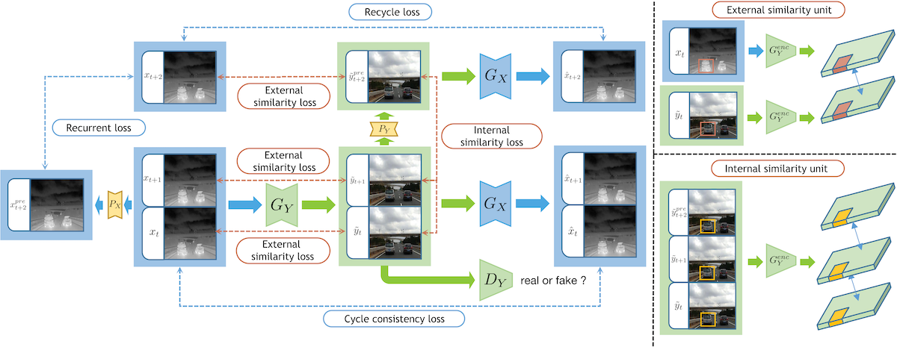
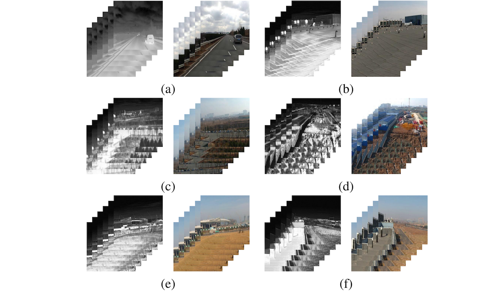

# I2V-GAN  
This repository is the official Pytorch implementation for ACMMM2021 paper  
"I2V-GAN: Unpaired Infrared-to-Visible Video Translation".  

#### Traffic I2V Example: (Download a pretrained model from [Baidu Netdisk](https://pan.baidu.com/s/1tKpsENwnUEaSdsCvnBzm8Q?pwd=Traf) [Access code: `Traf`] or [Google drive](https://drive.google.com/file/d/1jpSmMvAqjffEnWzPLD1OR8aODoOmG4vy/view?usp=sharing))


#### Monitoring I2V Example:


#### Flower Translation Example:


## Introduction  
### Abstract  
Human vision is often adversely affected by complex environmental factors, especially in night vision scenarios. Thus, infrared cameras are often leveraged to help enhance the visual effects via detecting infrared radiation in the surrounding environment, but the infrared videos are undesirable due to the lack of detailed semantic information. In such a case, an effective video-to-video translation method from the infrared domain to the visible counterpart is strongly needed by overcoming the intrinsic huge gap between infrared and visible fields.  
Our work propose an infrared-to-visible (I2V) video translation method I2V-GAN to generate fine-grained and spatial-temporal consistent visible light video by given an unpaired infrared video.  
The backbone network follows Cycle-GAN and Recycle-GAN.  


Technically, our model capitalizes on three types of constraints: adversarial constraint to generate synthetic frame that is similar to the real one, cyclic consistency with the introduced perceptual loss for effective content conversion as well as style preservation, and similarity constraint across and within domains to enhance the content and motion consistency in both spatial and temporal spaces at a fine-grained level. 



### IRVI Dataset
Download from [Baidu Netdisk](https://pan.baidu.com/s/1og7bcuVDModuBJhEQXWPxg?pwd=IRVI) [Access code: `IRVI`] or [Google Drive](https://drive.google.com/file/d/1ZcJ0EfF5n_uqtsLc7-8hJgTcr2zHSXY3/view?usp=sharing).



#### Data Structure
<table >
  <tr>
    <td colspan="2">SUBSET</td>
    <td>TRAIN</td>
    <td>TEST</td>
    <td colspan="2">TOTAL FRAME</td>
  </tr>
  <tr>
    <td colspan="2">Traffic</td>
    <td>17000</td>
    <td>1000</td>
    <td colspan="2">18000</td>
  </tr>
  <tr>
    <td rowspan="5">Mornitoring</td>
    <td >sub-1</td>
    <td >1384</td>
    <td >347</td>
    <td >1731</td>
    <td rowspan="5">6352</td>
  </tr>
  <tr>
    <td >sub-2</td>
    <td >1040</td>
    <td >260</td>
    <td >1300</td>
  </tr>
  <tr>
    <td >sub-3</td>
    <td >1232</td>
    <td >308</td>
    <td >1540</td>
  </tr>
  <tr>
    <td >sub-4</td>
    <td >672</td>
    <td >169</td>
    <td >841</td>
  </tr>
  <tr>
    <td >sub-5</td>
    <td >752</td>
    <td >188</td>
    <td >940</td>
  </tr>
</table>

## Installation
The code is implemented with `Python(3.6)` and `Pytorch(1.9.0)` for `CUDA Version 11.2`

Install dependencies:  
`pip install -r requirements.txt`

## Usage

### Train
```
python train.py --dataroot /path/to/dataset \
--display_env visdom_env_name --name exp_name \
--model i2vgan --which_model_netG resnet_6blocks \
--no_dropout --pool_size 0 \
--which_model_netP unet_128 --npf 8 --dataset_mode unaligned_triplet
```

### Test
```
python test.py --dataroot /path/to/dataset \
--which_epoch latest --name exp_name --model cycle_gan \
--which_model_netG resnet_6blocks --which_model_netP unet_128 \
--dataset_mode unaligned --no_dropout --loadSize 256 --resize_or_crop crop
```

## Citation
If you find our work useful in your research or publication, please cite our work:  
```
@inproceedings{I2V-GAN2021,
  title     = {I2V-GAN: Unpaired Infrared-to-Visible Video Translation},
  author    = {Shuang Li and Bingfeng Han and Zhenjie Yu and Chi Harold Liu and Kai Chen and Shuigen Wang},
  booktitle = {ACMMM},
  year      = {2021}
}
```


#### Acknowledgements
This code borrows heavily from the PyTorch implementation of [Cycle-GAN and Pix2Pix](https://github.com/junyanz/pytorch-CycleGAN-and-pix2pix) and [RecycleGAN](https://github.com/aayushbansal/Recycle-GAN).  
A huge thanks to them!
```
@inproceedings{CycleGAN2017,
  title     = {Unpaired Image-to-Image Translation using Cycle-Consistent Adversarial Networkss},
  author    = {Zhu, Jun-Yan and Park, Taesung and Isola, Phillip and Efros, Alexei A},
  booktitle = {ICCV},
  year      = {2017}
}

@inproceedings{Recycle-GAN2018,
  title     = {Recycle-GAN: Unsupervised Video Retargeting},
  author    = {Aayush Bansal and Shugao Ma and Deva Ramanan and Yaser Sheikh},
  booktitle = {ECCV},
  year      = {2018}
}
```
